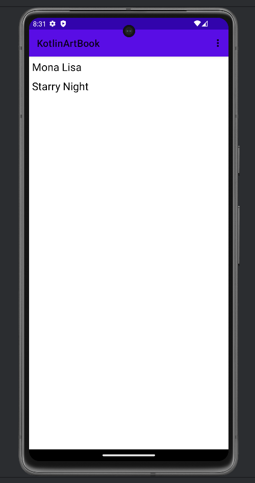
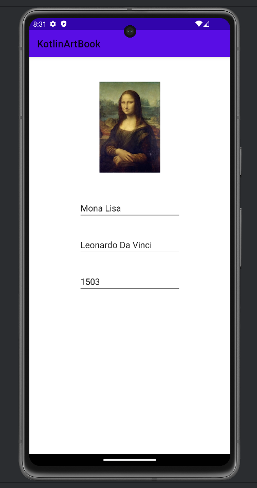

# ArtBook App

This is a simple Android application developed with Kotlin.

## Features
- Displays a list of artworks using RecyclerView
- Users can view artwork details
- Basic add and delete functionality
- Stores data locally

## Technologies Used
- Kotlin
- Android Studio
- RecyclerView
- SQLite / Local Storage

## Screenshots

### Main Screen

### Detail Screen

## How to Run
- Clone the project
- Open in Android Studio
- Sync Gradle
- Run on an emulator or physical device
